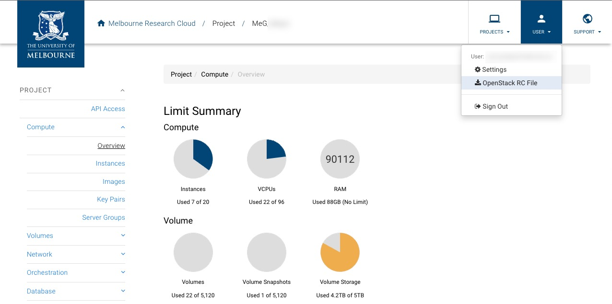
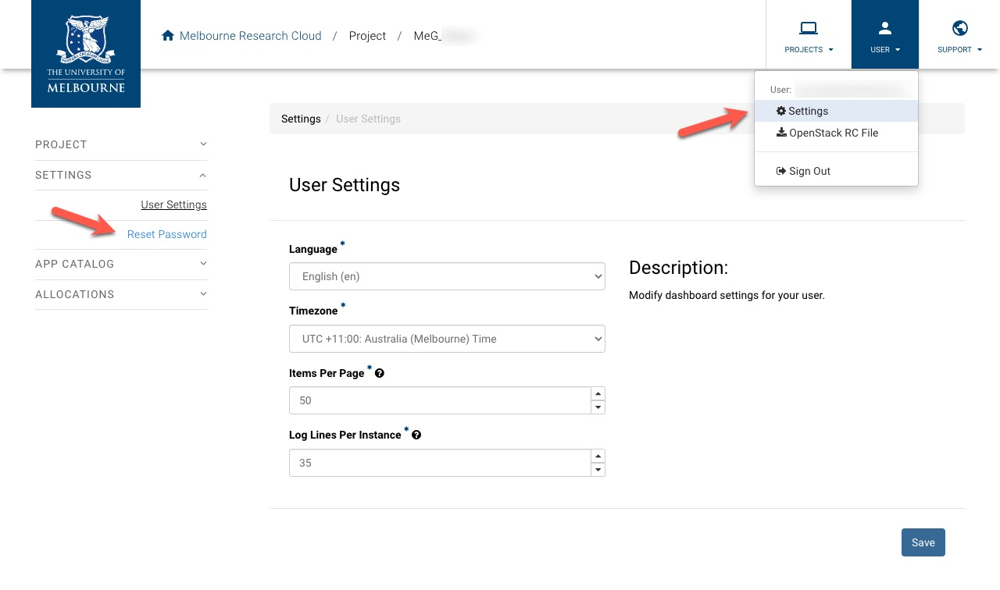
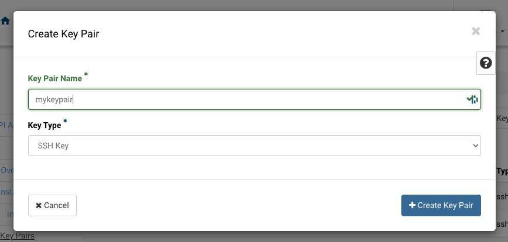

# Software Stack Installation

## Pre-requirements

- OpenStack clients 6.3.x ([Installation instructions](https://docs.openstack.org/newton/user-guide/common/cli-install-openstack-command-line-clients.html)).
  > Note: Please ensure the following Openstack clients are installed: `python-cinderclient`, `python-keystoneclient`, `python-magnumclient`, `python-neutronclient`, `python-novaclient`, `python-octaviaclient`. See: [Install the OpenStack client](https://docs.openstack.org/newton/user-guide/common/cli-install-openstack-command-line-clients.html).
- JQ 1.6.x ([Installation instructions](https://jqlang.github.io/jq/download/)).
- Kubectl 1.26.8 ([Installation instructions](https://kubernetes.io/docs/tasks/tools/)).
- Helm 3.6.3 ([Installation instructions](https://helm.sh/docs/intro/install/)).
- MRC project with enough resources to create a Kubernetes cluster.
- Connect to [Campus network](https://studentit.unimelb.edu.au/wifi-vpn#uniwireless) if on-campus or [UniMelb Student VPN](https://studentit.unimelb.edu.au/wifi-vpn#vpn) if off-campus

Open a shell and move to the directory of the repository that contains this README file.

## Client Configuration

1. Log in to the [MRC Dashboard](https://dashboard.cloud.unimelb.edu.au/auth/login/?next=/) with your University of Melbourne credentials and select the project you want to use.
   

2. Download the OpenStack RC file from the `User` menu.
   

3. Obtain the Openstack password from `User` -> `Settings` menu, click on `Reset Password` on the left and save the password in a safe place.
   

4. Source the OpenStack RC file downloaded in step 2 in your terminal and enter the password obtained in step 3 when prompted.

> Note: Password will not be displayed on the screen when typed.

```shell
source ./<your project name>-openrc.sh
```

5. Click `Project` -> `Compute` -> `Key Pairs` -> `Create Key Pair` and create a new key pair named `mykeypair` (replace `mykeypair` with the name you prefer). Keep the private key file downloaded (e.g. `mykeypair.pem`) in a safe place.
   
   

6. All team members must have their key pairs created and the public key file added to the project (see the previous step).

## Cluster Template Creation

- Run the following command to create a cluster template named `kubernetes-melbourne-qh2-uom-nofloat-v1.26.8`

> Note: Replace the `mykeypair` and `uom.mse.2c9g` with the key pair you created in the previous step, and the flavor you want to use for the master and worker nodes respectively.

```shell
openstack coe cluster template create \
  --keypair mykeypair \
  --labels "container_infra_prefix=registry.rc.nectar.org.au/nectarmagnum/; \
master_lb_floating_ip_enabled=false;\
cinder_csi_enabled=true;\
docker_volume_type=standard;\
ingress_controller=octavia;\
container_runtime=containerd;\
containerd_version=1.6.20;\
containerd_tarball_sha256=1d86b534c7bba51b78a7eeb1b67dd2ac6c0edeb01c034cc5f590d5ccd824b416;\
kube_tag=v1.26.8;\
flannel_tag=v0.21.5;\
cloud_provider_tag=v1.26.3;\
cinder_csi_plugin_tag=v1.26.3;\
k8s_keystone_auth_tag=v1.26.3;\
octavia_ingress_controller_tag=v1.26.3;\
coredns_tag=1.10.1;\
csi_snapshotter_tag=v6.2.1;\
csi_attacher_tag=v4.2.0;\
csi_resizer_tag=v1.7.0;\
csi_provisioner_tag=v3.4.1;\
csi_node_driver_registrar_tag=v2.8.0;\
availability_zone=melbourne-qh2-uom;\
fixed_subnet_cidr=192.168.10.0/24" \
  --floating-ip-disabled \
  --master-lb-enabled \
  --master-flavor=$(openstack flavor list | grep 'uom.mse.2c9g' | awk '{print $2}') \
  --flavor=$(openstack flavor list | grep 'uom.mse.2c9g' | awk '{print $2}') \
  --server-type='vm'\
  --external-network='melbourne' \
  --image='fedora-coreos-37' \
  --volume-driver='cinder' \
  --docker-storage-driver='overlay2' \
  --network-driver='flannel' \
  --coe='kubernetes' \
  --dns-nameserver='128.250.201.5,128.250.66.5' \
  kubernetes-melbourne-qh2-uom-nofloat-v1.26.8
```

- Verify that template has been created successfully.

```shell
openstack coe cluster template show $(openstack coe cluster template list | grep "kubernetes-melbourne-qh2-uom-nofloat-v1.26.8" | awk '{print $2}') --fit-width
```

## Kubernetes Cluster Provisioning

- Create a Kubernetes cluster named "elastic" with the newly created template (1 master node and 3 worker nodes).

```shell
openstack coe cluster create\
  --cluster-template "kubernetes-melbourne-qh2-uom-nofloat-v1.26.8" \
  --node-count 3 \
  --master-count 1 \
  elastic
```

- Check whether the cluster has been created healthy (it may take more than 15 minutes).

```shell
openstack coe cluster show elastic --fit-width
```

(`health_status` should be 'UNKNOWN' and `coe_version` should be `v1.26.8`);

- Create a security group named 'elastic-ssh' that allows SSH access from the University of Melbourne network.

```shell
openstack security group create elastic-ssh --fit-width
openstack security group rule create --proto tcp --dst-port 22 --remote-ip 0.0.0.0/0 elastic-ssh --fit-width
```

- Create a network port named 'elastic-bastion'.

```shell
openstack port create --network elastic elastic-bastion
```

- Create a VM named "bastion" with the following features (the VM can be created using the MRC Dashboard or with the command below).
  - Flavor: `uom.mse.1c4g`;
  - Image: `NeCTAR Ubuntu 22.04 LTS (Jammy) amd64 (with Docker)`;
  - Networks: `qh2-uom-internal` and `elastic` (the Kubernetes cluster network);
  - Security group: `default` and `ssh`;
  - NOTE: remember to change the `myeypair` name to your keypair name.
    
```shell
openstack server create \
  --flavor uom.mse.1c4g \
  --availability-zone melbourne-qh2-uom \
  --image $(openstack image list --name "NeCTAR Ubuntu 22.04 LTS (Jammy) amd64 (with Docker)" -c ID -f value) \
  --nic net-id=$(openstack network show qh2-uom-internal -f value -c id) \
  --nic port-id=$(openstack port show elastic-bastion -f value -c id) \
  --security-group "elastic-ssh" \
  --key-name mykeypair \
  bastion
```

- Store the bastion node IP address in a variable.

```shell
bastion=$(openstack server show bastion -c addresses -f json | jq -r '.addresses["qh2-uom-internal"][]')
```

- Add your team members' public SSH keys to the bastion node

```shell
pubkey=$(cat ~/<public ssh key>)
ssh -i <path-to-private-key> (e.g. ~/Downloads/mykeypair.pem) ubuntu@${bastion} "echo ${pubkey} >> ~/.ssh/authorized_keys"
```

The command above will append the public key to the `authorized_keys` file and has to be executed for each member.
The public SSH key file is the same as the keypair added to the project during the MRC project setup.
Plese note that the private SSH key in the command above is the same as the one used to create the bastion node, while
the public key file is the keypair for all the other team members.

- Add staff's public SSH keys to the bastion node
Use the instructions above to add the staff's public SSH keys. The two public SSH keys are
contained in the `yaopan_pubkey.pem` and `lmorandini_pubkey.pem` files of the `installation` directory.
 
## Accessing the Kubernetes Cluster

- Once the VM has been created successfully, open an SSH tunnel that allows the connection of your computer to the Kubernetes cluster. Please replace the `<path-to-private-key>` with the path to the private key file downloaded in the previous step.

```shell
chmod 600 <path-to-private-key> (e.g. ~/Downloads/mykeypair.pem)

ssh -i <path-to-private-key> (e.g. ~/Downloads/mykeypair.pem) -L 6443:$(openstack coe cluster show elastic -f json | jq -r '.master_addresses[]'):6443 ubuntu@$(openstack server show bastion -c addresses -f json | jq -r '.addresses["qh2-uom-internal"][]')
```

> Note: The SSH command may take up to 1 minute to complete.


- Create the Kubernetes configuration file to access the cluster. This command will create a file named `config` in the current directory.

```shell
openstack coe cluster config elastic
```

- Modify the `config` file by changing the IP address os the server to `127.0.0.1` (as in `server: https://127.0.0.1:6443`)

```shell
awk '
    /^    server:/ { sub(/https:\/\/[^:]+/, "https://127.0.0.1") }
    { print }
' config > temp && mv temp config
```

- Move the config file to `~/.kube/config`.

> Note: If you already have a `~/.kube/config` file, please back it up before executing the following command.

```shell
mv config ~/.kube/config
chmod 600 ~/.kube/config
```

Note: once the `~/.kube/config` file has been created by the team member that has created the Kubernetes cluster, it can be
shared across the other team members.

- Check the cluster nodes:

```shell
kubectl get nodes
```

This command should return one master node and the required number of worker nodes.

```shell
NAME                            STATUS   ROLES    AGE     VERSION
elastic-4spknhuyv5bf-master-0   Ready    master   6m16s   v1.26.8
elastic-4spknhuyv5bf-node-0     Ready    <none>   3m27s   v1.26.8
elastic-4spknhuyv5bf-node-1     Ready    <none>   3m9s    v1.26.8
elastic-4spknhuyv5bf-node-2     Ready    <none>   3m31s   v1.26.8
```

> Note: After creating the cluster, check the overlay network component is running correctly:

```shell
kubectl get pod -l app=flannel -n kube-system
```

This command should return a number of pods named `flannel-xxxxx` with status `Running`.

```shell
NAME                    READY   STATUS    RESTARTS   AGE
kube-flannel-ds-9pvdl   1/1     Running   0          31h
kube-flannel-ds-gzvfk   1/1     Running   0          31h
kube-flannel-ds-nx6mg   1/1     Running   0          31h
kube-flannel-ds-sx8dp   1/1     Running   0          31h
```

If any of the pods is not in running state, to drop and recreate the pod.

```shell
kubectl delete pod -l app=flannel -n kube-system
```

## ElasticSearch cluster deployment

Set the ElasticSearch version to be used, then install ElasticSearch:

```shell
export ES_VERSION="8.5.1"
kubectl create namespace elastic
helm repo add elastic https://helm.elastic.co
helm repo update
helm upgrade --install \
  --version=${ES_VERSION} \
  --namespace elastic \
  --set replicas=2 \
  --set secret.password="elastic"\
  --set volumeClaimTemplate.resources.requests.storage="100Gi" \
  elasticsearch elastic/elasticsearch
```

NOTES:
- By default each ElasticSearch node has 30GB of storage;
- The number of nodes is set by the `replicas` parameter. not to be confused with the "shard replicas" (copies of a shard);
- The number of replicas (nodes) that can be used in the cluster is limited by the number of nodes in the cluster and by the Kibana deployment that needs a node for itself.
- Passing an unsafe password as `secret.password` to Helm is a security risk and it's done here for the sake of simplicity: in a production environment the password must be randomly generated and of suitable length (secure passwords can be generated with the Linux command `pwgen -n 32`).

Check all ElasticSearch pods are running before proceeding:

```shell
kubectl get pods -l release=elasticsearch -n elastic --watch
```

This command will watch the pods' status. You can use `Ctrl + C` to stop watching once you see the pods are in `Running` state.

```shell
NAME                     READY   STATUS     RESTARTS   AGE
elasticsearch-master-0   0/1     Init:0/1   0          20s
elasticsearch-master-1   0/1     Init:0/1   0          20s
elasticsearch-master-0   0/1     Init:0/1   0          59s
elasticsearch-master-1   0/1     Init:0/1   0          59s
elasticsearch-master-1   0/1     PodInitializing   0          60s
elasticsearch-master-0   0/1     PodInitializing   0          61s
elasticsearch-master-1   0/1     Running           0          61s
elasticsearch-master-0   0/1     Running           0          62s
```

## Kibana deployment

```shell
helm upgrade --install \
  --version=${ES_VERSION} \
  --namespace elastic \
  -f ./installation/kibana-values.yaml \
  kibana elastic/kibana
```

Check all ElasticSearch pods are running before proceeding:

```shell
kubectl get pods -l release=kibana -n elastic --watch
```

This command will watch the pods' status. You can use `Ctrl + C` to stop watching once you see the pods are in `Running` state.

Check all services are created before proceeding.

```shell
kubectl get service -n elastic
```

This command will list all service in the Kubernetes cluster.

```shell
NAME                            TYPE        CLUSTER-IP     EXTERNAL-IP   PORT(S)             AGE
elasticsearch-master            ClusterIP   10.254.75.27   <none>        9200/TCP,9300/TCP   17h
elasticsearch-master-headless   ClusterIP   None           <none>        9200/TCP,9300/TCP   17h
kibana-kibana                   ClusterIP   10.254.50.97   <none>        5601/TCP            17h
```

## Fission Deployment

> Note: make sure the SSH tunnel has been established to the Kubernetes cluster.

```shell
export FISSION_VERSION='1.20.0'
kubectl create -k "github.com/fission/fission/crds/v1?ref=v${FISSION_VERSION}"

helm repo add fission-charts https://fission.github.io/fission-charts/
helm repo update
helm upgrade fission fission-charts/fission-all --install --version v${FISSION_VERSION} --namespace fission \
  --create-namespace --set routerServiceType='ClusterIP'
```

> Note: for detailed instructions see [here](https://fission.io/docs/installation/)

After the installation, wait for all pods to have started. (This command will watch the pods' status. You can use `Ctrl + C` to stop watching once you see the pods are in `Running` state.)

```shell
kubectl get pods -n fission --watch
```

## Fission Client

Mac & Linux:

```shell
OS=$(uname -s | tr '[:upper:]' '[:lower:]')
curl -Lo fission https://github.com/fission/fission/releases/download/v$FISSION_VERSION/fission-v$FISSION_VERSION-$OS-amd64 \
   && chmod +x fission && sudo mv fission /usr/local/bin/
```

Windows:

For Windows, please use the Linux binary on WSL.

asdf:

Alternatively, you can install the Fission CLI using asdf:

```shell
asdf plugin add fission
asdf install fission $FISSION_VERSION
asdf local fission $FISSION_VERSION
```

## Stack installation test

The following command creates and test a function named `health` that returns the status of the ElasticSearch cluster:

```shell
fission env create --name python --image fission/python-env --builder fission/python-builder
fission function create --name health --env python --code ./fission/functions/health.py
fission function test --name health | jq '.'
```

If the above command returns a JSON object with the ElasticSearch cluster status, the installation is successful, and
the Fission function and environment can be deleted:

```shell
fission function delete --name health
fission env delete --name python
```

We now know that the ElasticSearch cluster is up and running, and the Fission installation is successful, let'd
try Kibana :
```shell
kubectl port-forward service/kibana-kibana -n elastic 5601:5601
```
(It uses t a Kubernetes port-forward of a service to access the Kibana dashboard on `http://localhost:5601`.)


## Removal of the software stack

THIS SHOULD BE DONE ONLY IN CASE OF A SERIOUS MISTAKE THAT PREVENTS USE OF THE CLUSTER.

## Fission removal

```shell
export FISSION_VERSION='1.20.0'

for e in $(kubectl get function -o=name) ; do
    kubectl delete ${e}
done

for e in $(kubectl get package -o=name) ; do
    kubectl delete ${e}
done

for e in $(kubectl get environment -o=name) ; do
    kubectl delete ${e}
done

for crd in $(kubectl get crd --template '{{range .items}}{{.metadata.name}}{{"\n"}}{{end}}' | grep fission) ; do
    kubectl delete crd ${crd}
done

helm uninstall fission --namespace fission

for p in $(kubectl get pods -o=name) ; do
    kubectl delete ${p}
done

for p in $(kubectl get kafkatopic -n kafka -o=name) ; do
    kubectl delete ${p} -n kafka
done

kubectl delete -k "github.com/fission/fission/crds/v1?ref=v${FISSION_VERSION}"
helm uninstall keda --namespace keda
helm uninstall kafka-ui
kubectl delete kafka my-cluster --namespace kafka
helm uninstall kafka --namespace kafka
```

### ElasticSearch Cluster Removal

```shell
helm uninstall kibana -n elastic
helm uninstall elasticsearch -n elastic
```

### Kubernetes Cluster Removal

```shell
openstack port delete $(openstack port show -f value -c id elastic-bastion)
openstack coe cluster delete elastic
openstack server delete bastion
```

Wait until the volumes became `available` and delete them:
```shell
openstack volume list -f value -c ID | xargs -i openstack volume delete {}
```

Remove the `elastic-ssh` security group:
```shell
openstack security group delete $(openstack security group show -f value -c id elastic-ssh)
```
